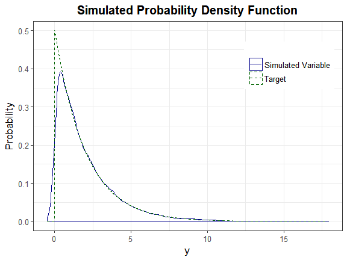
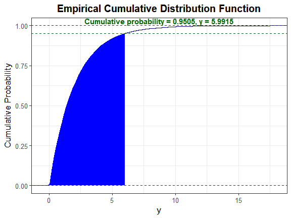

<!-- README.md is generated from README.Rmd. Please edit that file -->
SimMultiCorrData
================

The goal of `SimMultiCorrData` is to generate continuous (normal or non-normal), binary, ordinal, and count (Poisson or Negative Binomial) variables with a specified correlation matrix. It can also produce a single continuous variable. This package can be used to simulate data sets that mimic real-world situations (i.e. clinical data sets, plasmodes, as in Vaughan et al., 2009). All variables are generated from standard normal variables with an imposed intermediate correlation matrix. Continuous variables are simulated by specifying mean, variance, skewness, standardized kurtosis, and fifth and sixth standardized cumulants using either Fleishman's Third-Order or Headrick's Fifth-Order Polynomial Transformation. Binary and ordinal variables are simulated using a modification of `GenOrd::ordsample`. Count variables are simulated using the inverse cdf method. There are two simulation pathways which differ primarily according to the calculation of the intermediate correlation matrix `Sigma`. In **Correlation Method 1**, the intercorrelations involving count variables are determined using a simulation based, logarithmic correlation correction (adapting Yahav and Shmueli's 2012 method). In **Correlation Method 2**, the count variables are treated as ordinal (adapting Barbiero and Ferrari's 2015 modification of `GenOrd`). There is an optional error loop that corrects the final correlation matrix to be within a user-specified precision value. The package also includes functions to calculate standardized cumulants for theoretical distributions or from real data sets, check if a target correlation matrix is within the possible correlation bounds (given the distributions of the simulated variables), summarize results (numerically or graphically), to verify valid power method pdfs, and to calculate lower standardized kurtosis bounds.

There are several vignettes which accompany this package that may help the user understand the simulation and analysis methods.

1.  **Benefits of SimMultiCorrData and Comparison to Other Packages** describes some of the ways `SimMultiCorrData` improves upon other simulation packages.

2.  **Variable Types** describes the different types of variables that can be simulated in `SimMultiCorrData`.

3.  **Function by Topic** describes each function, separated by topic.

4.  **Comparison of Correlation Method 1 and Correlation Method 2** describes the two simulation pathways that can be followed.

5.  **Overview of Error Loop** details the algorithm involved in the optional error loop that improves the accuracy of the simulated variables' correlation matrix.

6.  **Overall Workflow for Data Simulation** gives a step-by-step guideline to follow with an example containing continuous (normal and non-normal), binary, ordinal, Poisson, and Negative Binomial variables. It also demonstrates the use of the standardized cumulant calculation function, correlation check functions, the lower kurtosis boundary function, and the plotting functions.

7.  **Comparison of Simulation Distribution to Theoretical Distribution or Empirical Data** gives a step-by-step guideline for comparing a simulated univariate continuous distribution to the target distribution with an example.

8.  **Using the Sixth Cumulant Correction to Find Valid Power Method Pdfs** demonstrates how to use the sixth cumulant correction to generate a valid power method pdf and the effects this has on the resulting distribution.

Installation instructions
-------------------------

`SimMultiCorrData` can be installed using the following code:

``` r
## from GitHub
install.packages("devtools")
devtools::install_github("AFialkowski/SimMultiCorrData")

## from CRAN
install.packages("SimMultiCorrData")
```

Example
-------

This is a basic example which shows you how to solve a common problem: Compare a simulated **exponential(mean = 2) variable** to the theoretical exponential(mean = 2) density.

### Step 1: Obtain the standardized cumulants

In R, the exponential parameter is rate &lt;- 1/mean.

``` r
library(SimMultiCorrData)

stcums <- calc_theory(Dist = "Exponential", params = 0.5)
stcums
#>     mean       sd     skew kurtosis    fifth    sixth 
#>        2        2        2        6       24      120
```

### Step 2: Simulate the variable

Note that `calc_theory` returns the standard deviation, not the variance. The simulation functions require variance as the input.

``` r
H_exp <- nonnormvar1("Polynomial", means = stcums[1], vars = stcums[2]^2, 
                     skews = stcums[3], skurts = stcums[4], 
                     fifths = stcums[5], sixths = stcums[6], Six = NULL, 
                     cstart = NULL, n = 10000, seed = 1234)
#> Constants: Distribution  1  
#> 
#> Constants calculation time: 0 minutes 
#> Total Simulation time: 0.001 minutes

names(H_exp)
#> [1] "constants"           "continuous_variable" "summary_continuous" 
#> [4] "summary_targetcont"  "sixth_correction"    "valid.pdf"          
#> [7] "Constants_Time"      "Simulation_Time"
# Look at constants
H_exp$constants
#>           c0        c1       c2         c3          c4           c5
#> 1 -0.3077396 0.8005605 0.318764 0.03350012 -0.00367481 0.0001587077

# Look at summary
round(H_exp$summary_continuous[, c("Distribution", "mean", "sd", "skew", 
                               "skurtosis", "fifth", "sixth")], 5)
#>    Distribution    mean     sd    skew skurtosis    fifth    sixth
#> X1            1 1.99987 2.0024 2.03382   6.18067 23.74145 100.3358
```

### Step 3: Determine if the constants generate a valid power method pdf

``` r
H_exp$valid.pdf
#> [1] "TRUE"
```

### Step 4: Select a critical value

Let alpha = 0.05.

``` r
y_star <- qexp(1 - 0.05, rate = 0.5) # note that rate = 1/mean
y_star
#> [1] 5.991465
```

### Step 5: Solve for $\\Large z'$

Since the exponential(2) distribution has a mean and standard deviation equal to 2, solve $\\Large 2 \* p(z') + 2 - y\_star = 0$ for $\\Large z'$. Here, $\\Large p(z') = c0 + c1 \* z' + c2 \* z'^2 + c3 \* z'^3 + c4 \* z'^4 + c5 \* z'^5$.

``` r
f_exp <- function(z, c, y) {
  return(2 * (c[1] + c[2] * z + c[3] * z^2 + c[4] * z^3 + c[5] * z^4 + 
                c[6] * z^5) + 2 - y)
}

z_prime <- uniroot(f_exp, interval = c(-1e06, 1e06), 
                   c = as.numeric(H_exp$constants), y = y_star)$root
z_prime
#> [1] 1.644926
```

### Step 6: Calculate $\\Large \\Phi(z')$

``` r
1 - pnorm(z_prime)
#> [1] 0.04999249
```

This is approximately equal to the alpha value of 0.05, indicating the method provides a **good approximation to the actual distribution.**

### Step 7: Plot graphs

``` r
plot_sim_pdf_theory(sim_y = as.numeric(H_exp$continuous_variable[, 1]), 
                    overlay = TRUE, Dist = "Exponential", params = 0.5)
```



We can also plot the empirical cdf and show the cumulative probability up to y\_star.

``` r
plot_sim_cdf(sim_y = as.numeric(H_exp$continuous_variable[, 1]), 
             calc_cprob = TRUE, delta = y_star)
```



### Calculate descriptive statistics.

``` r
stats_pdf(c = H_exp$constants[1, ], method = "Polynomial", alpha = 0.025, 
          mu = 2, sigma = 2)
#> trimmed_mean       median         mode   max_height 
#>     1.858381     1.384521     0.104872     1.094213
```
