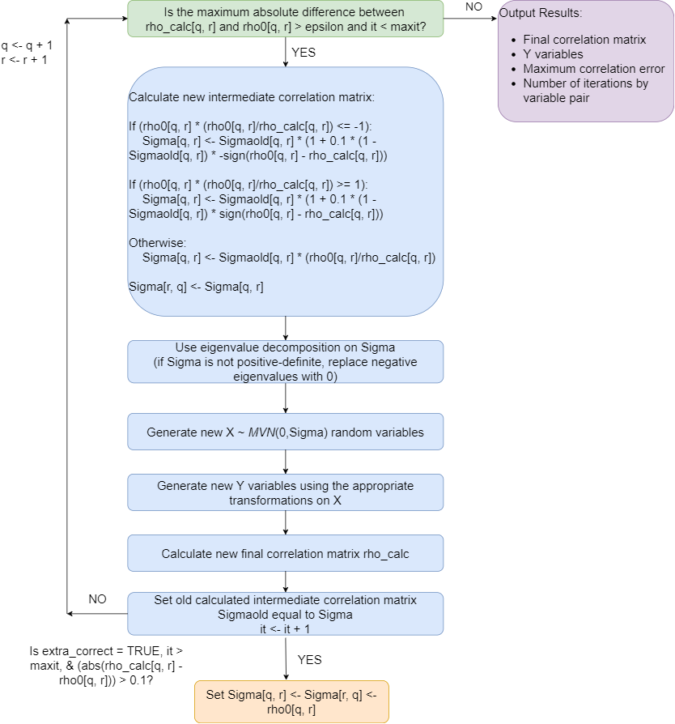

```{r, echo = FALSE}
#knitr::opts_chunk$set(collapse = TRUE, comment = "#>")
```

The **error loop** may be used to correct the final correlation of simulated variables to be within a user-specified precision value (`epsilon`) of the target correlation.  It updates the pairwise intermediate MVN correlation iteratively in a loop until either the maximum error is less than `epsilon` or the number of iterations exceeds the maximum number set by the user (`maxit`).  It uses `SimMultiCorrData::error_vars` to simulate the pair of variables in each iteration.  The function is a modification of  Barbiero & Ferrari's `ordcont` function in the `GenOrd` package in the following ways: 

1. It works for continuous, ordinal (r >= 2 categories), and count variables.
1. The initial positive-definite correlation check has been removed because the intermediate correlation `Sigma` from `rcorrvar` or `rcorrvar2` has already been used to generate variables.

    a) the pairwise correlation matrix is checked in each iteration 
    b) if necessary, this matrix is converted to the nearest positive-definite matrix using the method of Higham (2002) and the `Matrix::nearPD` function
    
1. The final positive-definite check has been removed.
1. The intermediate correlation update function was changed to accommodate more situations.
1. An optional final "fail-safe" check was added at the end of the iteration loop where if the absolute error between the final and target pairwise correlation is still > 0.1, the intermediate correlation is set equal to the target correlation (if `extra_correct` = "TRUE")
1. Allowing specifications for the sample size and the seed for reproducibility.  

The error loop does increase simulation time, but it can improve accuracy in most situations.  

Below is a schematic of the algorithm.  In the figure, `rho_calc` is the calculated final correlation matrix updated in each iteration, `rho_calcold` is the final correlation matrix before the error loop, `rho0` is the target final correlation matrix, `Sigmaold` is the intermediate correlation matrix from the previous iteration, `it` is the iteration number, `q` is the row number, and `r` is the column number.  In addition, `extra_correct` refers to the setting in the simulation functions (see `rcorrvar` and `rcorrvar2`).


